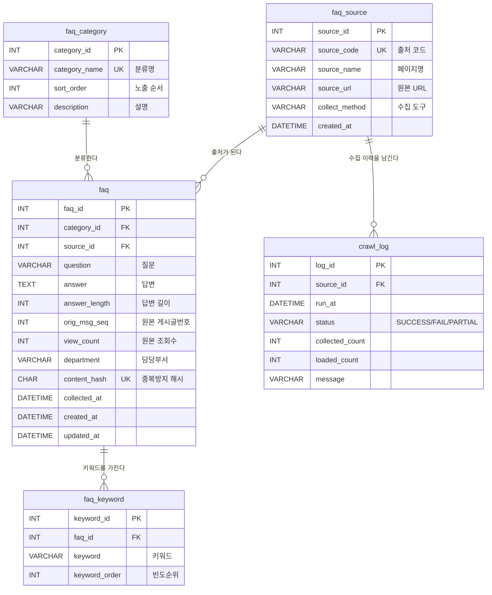

# 데이터베이스 설계 문서 (산출물 ①)

- **프로젝트** 우리동네 장애인 콜택시 — 서울시 장애인콜택시 이용현황 분석 및 조회 시스템
- **담당 파트** FAQ (서울시설공단 공식 홈페이지 → Q&A 재구성)
- **DBMS** MySQL 8.x / 문자셋 `utf8mb4` · 정렬 `utf8mb4_unicode_ci`
- **스키마명** `seoul_calltaxi`
- **DDL 원본** [`db/schema.sql`](../db/schema.sql)

---

## 1. 설계 목표

| 목표 | 설계에 반영한 내용 |
|---|---|
| 분류 기준을 코드로 고정 | 카테고리를 문자열로 반복 저장하지 않고 `faq_category` 마스터로 분리 |
| 데이터 출처 추적 | 어떤 페이지를 어떤 도구로 수집했는지 `faq_source`에 기록 |
| 재수집 시 중복 방지 | 질문+답변의 MD5를 `faq.content_hash`에 저장하고 UNIQUE 제약 |
| 검색 성능 확보 | 키워드를 `faq_keyword`로 1:N 분리하고 `keyword` 인덱스 부여 |
| 운영 이력 관리 | 수집·적재 실행 결과를 `crawl_log`에 축적 |

---

## 2. 테이블 목록

| # | 테이블 | 역할 | 성격 | 예상 건수 |
|---|---|---|---|---|
| 1 | `faq_category` | FAQ 분류 코드 | 마스터 | 7 |
| 2 | `faq_source` | 수집 출처 페이지 | 마스터 | 8 |
| 3 | `faq` | FAQ 질문·답변 본문 | 트랜잭션(핵심) | 21 |
| 4 | `faq_keyword` | 검색용 키워드 | 상세(1:N) | 105 |
| 5 | `crawl_log` | 수집 실행 이력 | 로그 | 실행 횟수만큼 |

---

## 3. ERD



### 관계 요약

```
faq_category (1) ──< (N) faq          카테고리 하나에 여러 FAQ
faq_source   (1) ──< (N) faq          출처 하나에서 여러 FAQ 수집
faq          (1) ──< (N) faq_keyword  FAQ 하나에 키워드 최대 5개
faq_source   (1) ──< (N) crawl_log    출처별 수집 이력 누적
```

---

## 4. 테이블 상세 명세

### 4.1 `faq_category` — FAQ 분류 마스터

| 컬럼 | 타입 | 제약 | 설명 |
|---|---|---|---|
| category_id | INT | PK, AUTO_INCREMENT | 카테고리 고유번호 |
| category_name | VARCHAR(30) | NOT NULL, UNIQUE | 분류명 |
| sort_order | INT | NOT NULL, DEFAULT 0 | 화면 노출 순서 |
| description | VARCHAR(200) | NULL | 분류 설명 |

기준값 7종 — 전처리의 표준 분류(`config.FAQ_CATEGORIES`)와 반드시 일치한다.

| id | 분류명 | 설명 |
|---|---|---|
| 1 | 가입·등록 | 이용 등록 절차, 제출 서류, 복지카드 확인 |
| 2 | 이용대상·자격 | 이용 가능 대상, 장애정도 기준, 동승·단독탑승 |
| 3 | 이용방법·접수 | 전화·문자·인터넷·앱 접수 방법 및 예약/취소 |
| 4 | 요금·결제 | 이용요금 산정 기준과 결제 방식 |
| 5 | 배차·대기 | 차량 연결 기준, 대기시간, 배차 지연 |
| 6 | 운행지역·시간 | 운행 범위(서울·수도권)와 운행 시간 |
| 7 | 준수사항·기타 | 이용자 준수사항 및 기타 문의 |

### 4.2 `faq_source` — 수집 출처 마스터

| 컬럼 | 타입 | 제약 | 설명 |
|---|---|---|---|
| source_id | INT | PK, AUTO_INCREMENT | 출처 고유번호 |
| source_code | VARCHAR(30) | NOT NULL, UNIQUE | 출처 코드 (`board_faq`, `receipt` 등) |
| source_name | VARCHAR(150) | NOT NULL | 출처 페이지명 |
| source_url | VARCHAR(500) | NOT NULL | 원본 URL |
| collect_method | VARCHAR(20) | NOT NULL | 수집 도구 (BeautifulSoup / Selenium) |
| created_at | DATETIME | DEFAULT CURRENT_TIMESTAMP | 등록 일시 |

### 4.3 `faq` — FAQ 본문 (핵심)

| 컬럼 | 타입 | 제약 | 설명 |
|---|---|---|---|
| faq_id | INT | PK, AUTO_INCREMENT | FAQ 고유번호 |
| category_id | INT | NOT NULL, FK → faq_category | 분류 |
| source_id | INT | NOT NULL, FK → faq_source | 출처 |
| question | VARCHAR(300) | NOT NULL | 질문 |
| answer | TEXT | NOT NULL | 답변 본문 |
| answer_length | INT | NOT NULL, DEFAULT 0 | 답변 길이(자) — 품질 점검용 |
| orig_msg_seq | INT | NULL | 원본 게시글 번호 (게시판 출처만) |
| view_count | INT | NULL | 원본 조회수 (게시판 출처만) |
| department | VARCHAR(50) | NULL | 담당 부서 |
| content_hash | CHAR(32) | NOT NULL, UNIQUE | MD5(질문+답변) — 중복 적재 방지 |
| collected_at | DATETIME | NOT NULL | 수집 일시 |
| created_at / updated_at | DATETIME | 자동 | 적재·수정 일시 |

**NULL 허용 사유** `orig_msg_seq`, `view_count`, `department`는 게시판 출처에만 존재하는
속성이다. 안내페이지에서 재구성한 FAQ에는 해당 값이 없으므로 NULL을 허용한다.

### 4.4 `faq_keyword` — 검색 키워드 (1:N)

| 컬럼 | 타입 | 제약 | 설명 |
|---|---|---|---|
| keyword_id | INT | PK, AUTO_INCREMENT | 키워드 고유번호 |
| faq_id | INT | NOT NULL, FK → faq (ON DELETE CASCADE) | FAQ |
| keyword | VARCHAR(50) | NOT NULL | 검색 키워드 |
| keyword_order | INT | NOT NULL, DEFAULT 1 | 빈도 순위(1이 최상위) |

`UNIQUE (faq_id, keyword)` — 같은 FAQ에 같은 키워드가 중복 저장되지 않는다.

### 4.5 `crawl_log` — 수집 실행 이력

| 컬럼 | 타입 | 제약 | 설명 |
|---|---|---|---|
| log_id | INT | PK, AUTO_INCREMENT | 이력 고유번호 |
| source_id | INT | NULL, FK → faq_source (ON DELETE SET NULL) | 출처 |
| run_at | DATETIME | DEFAULT CURRENT_TIMESTAMP | 실행 일시 |
| status | VARCHAR(10) | NOT NULL | SUCCESS / FAIL / PARTIAL |
| collected_count | INT | DEFAULT 0 | 수집 건수 |
| loaded_count | INT | DEFAULT 0 | 적재 건수 |
| message | VARCHAR(500) | NULL | 비고 / 오류 메시지 |

---

## 5. 정규화 검토

| 단계 | 적용 내용 |
|---|---|
| 1NF | 키워드를 `"가입,등록,서류"` 처럼 한 칸에 몰아넣지 않고 `faq_keyword` 행으로 분리 |
| 2NF | 모든 비키 컬럼이 기본키 전체에 종속 (복합키 미사용, 단일 대리키 사용) |
| 3NF | 카테고리명·출처명을 `faq`에 중복 저장하지 않고 마스터 테이블 FK로 참조 |

**의도적 비정규화** `answer_length`는 `answer`에서 계산 가능한 파생 컬럼이지만,
품질 점검·정렬에 자주 쓰여 조회 편의를 위해 컬럼으로 유지한다.

---

## 6. 인덱스 설계

| 테이블 | 인덱스 | 종류 | 목적 |
|---|---|---|---|
| faq | `uk_faq_content_hash` | UNIQUE | 재수집 시 동일 내용 중복 적재 차단 |
| faq | `idx_faq_category` | 보조 | 분류별 조회 (화면 기본 필터) |
| faq | `idx_faq_source` | 보조 | 출처별 조회 및 JOIN |
| faq | `idx_faq_question` | 보조 | 질문 정렬·검색 |
| faq_keyword | `idx_keyword` | 보조 | 키워드 검색 |
| faq_keyword | `uk_faq_keyword` | UNIQUE | (FAQ, 키워드) 중복 방지 |
| faq_source | `uk_source_code` | UNIQUE | 출처 코드 UPSERT 기준 |

---

## 7. ERD 도구로 확인하는 방법

### DBeaver (설치되어 있음)

1. 좌측 **Database Navigator**에서 `seoul_calltaxi` 스키마를 펼친다.
2. 스키마 노드를 더블클릭 → 우측 탭에서 **ER Diagram** 선택.
3. FK 관계선이 자동으로 그려진다. 우클릭 → *Export Diagram*으로 PNG 저장 후 보고서에 첨부.

> 다이어그램이 비어 보이면 `db/loader.py`를 먼저 실행해 테이블이 생성됐는지 확인한다.

### 무료 웹 ERD 도구 (ERDCloud 등)

[`db/schema.sql`](../db/schema.sql) 내용을 그대로 **Import SQL / DDL 붙여넣기** 기능에
입력하면 위 Mermaid ERD와 동일한 관계도가 생성된다.

### Markdown 미리보기

이 문서의 Mermaid 블록은 GitHub·VS Code 미리보기에서 바로 렌더링된다.

---

## 8. 팀 통합 시 유의사항

- 이 스키마는 **FAQ 파트 전용 5개 테이블**만 정의한다.
- 다른 파트(이용현황·예약·뉴스)는 같은 `seoul_calltaxi` DB 안에 각자 테이블을 추가한다.
- 테이블명 충돌을 피하기 위해 파트별 접두어를 권장한다. (FAQ 파트는 `faq_` 사용 중)
- 공통 코드성 테이블(예: 자치구 코드)이 필요해지면 별도 마스터로 분리해 공유한다.
